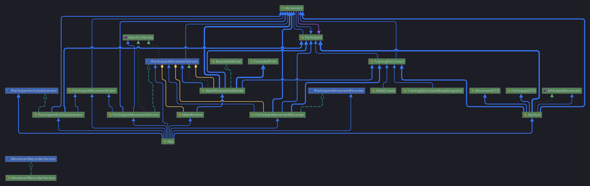
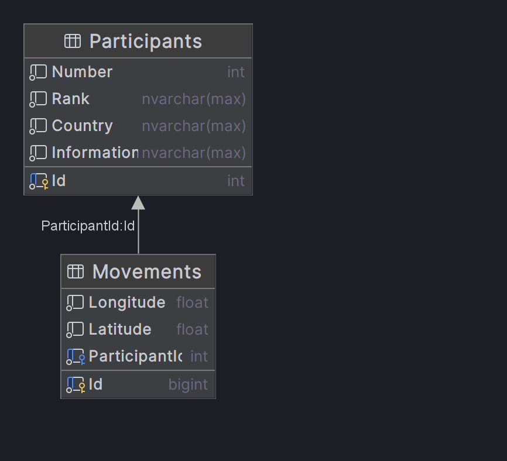

# TrainingExerciseTracking
The description of the coding challenge can be found [here](Resources/CodeChallenge.pdf).

## Setup
Setting up MSSQL with docker:
```bash
docker pull mcr.microsoft.com/mssql/server:2022-latest
docker run -e "ACCEPT_EULA=Y" -e "MSSQL_SA_PASSWORD=Sml123456789" -p 1433:1433 -d mcr.microsoft.com/mssql/server:2022-latest
```
The database migration will be applied automatically when the application starts. 

## Architecture

### TypeDependency Diagram


### Database EER Diagram


## API
The api launches on port 5000 and has 2 endpoints
* /movements
* /participants

These endpoints can be used to inject data